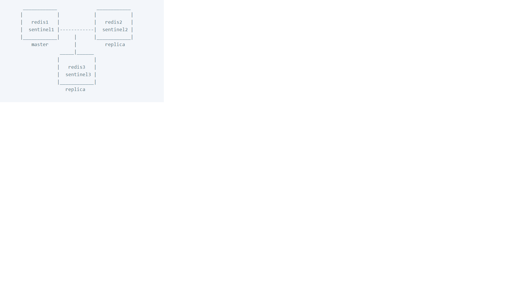
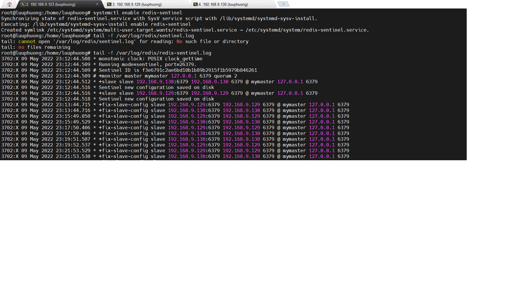

# yêu cầu 3 máy ubuntu server
## sudo privileges ở cả 3 máy
- run lệnh
 ```
 sudo su 
 ```
 ## use case
  
 - redis1 và sentinel1 cài đặt trên máy có địa chỉ ip là 192.168.9.123
 - redis2 và sentinel2 cài đặt trên máy có địa chỉ ip là 192.168.9.129
 - redis3 và sentinel3 cài đặt trên máy có địa chỉ ip là 192.168.9.130

> Ta có redis1 là master còn redis2 và redis3 là replica

## INSTALL Redis chạy ở cả 3 máy
- Add the repository to the apt index
```
add-apt-repository ppa:redislabs/redis
```
- Update repository and install redis
```
apt update && apt install redis
```
- active redis
```
systemctl enable redis-server
```
## Cài đặt Redis Master
- truy cập vào máy cài redis1(192.168.9.123 ở trên ) mở file cấu hình redis:
```
nano /etc/redis/redis.conf
```
- Find these configuration, uncomment, and edit them
```
bind 0.0.0.0
requirepass "<your-password>"  // change the password
masterauth "<your-password>"   // change the password
```
> thay đổi password ở requirepass và masterauth giống nhau ở cả 3 máy
- sau khi sử xong thì lưu lại và restart lại dịch vụ
```
service redis-server restart
```

## Cài đặt Redis Replica
- vào 2 máy cài redis2 và redis3. truy cập sửa đổi file cấu hình:
```
nano /etc/redis/redis.conf
```
- Find these configuration, uncomment, and edit them
```
bind 0.0.0.0
requirepass "<your-password>"  // change the password
replicaof 192.168.9.123 6379
masterauth "<your-password>"   // change the password
```
> chú ý: 192.168.9.123 là địa chỉ máy cài redis1 (redis master) còn 6379 là cổng và password phải giống nhau ở cả 3 máy.
- sau khi sửa xong thì restart lại dịch vụ
```
service redis-server restart
```

## Kiểm tra Master-Replica
- có thể kiểm tra bằng cách Set một số key trên redis master và sau đó lấy giá trị key đó trên redis replica
  - Trên Redis Master(Redis1) chạy các lệnh sau:
    ```
    redis-cli
    ```
    ```
    auth <your-password> (chú ý: password này là password nãy mình đặt ở trên là password của requirepass và masterauth)
    ```
    ```
    SET foo bar
    ```
    - Trên Redis Replica (Redis2 và redis3) ta chạy các lệnh sau:
     ```
     redis-cli
     ```
     ```
     auth <your-password>
     ```
     ```
     GET foo
     ```
     > kết quả trả về của GET sẽ là giá trị 'bar'

# Cấu hình Redis Sentinel

- Trên Sentinel1 (Redis1 hay Redis master)  ta mở file cấu hình:
```
nano /etc/redis/sentinel.conf
```
- copy và paste script vào file cấu hình sentinel1:
```
daemonize yes
port 26379
bind 0.0.0.0
supervised systemd
pidfile "/run/redis/redis-sentinel.pid"
logfile "/var/log/redis/sentinel.log"
sentinel monitor mymaster 127.0.0.1 6379 2
sentinel auth-pass mymaster <your-password>
sentinel down-after-milliseconds mymaster 5000
sentinel failover-timeout mymaster 60000
sentinel parallel-syncs mymaster 1
```
> chú ý: thay đổi <your-password>. mật khẩu do mình đặt ở trên


- còn trên sentinel2 và sentinel3 ta mở file cấu hình và copy, paste script sau vào:
```
daemonize yes
port 26379
bind 0.0.0.0
supervised systemd
pidfile "/run/redis/redis-sentinel.pid"
logfile "/var/log/redis/sentinel.log"
sentinel monitor mymaster 192.168.9.123 6379 2
sentinel auth-pass mymaster <your-password>
sentinel down-after-milliseconds mymaster 5000
sentinel failover-timeout mymaster 60000
sentinel parallel-syncs mymaster 1
```
> chú ý: thay <your-password> và địa chỉ 192.168.9.123 là địa chỉ của redis1 hay redis master

- sau đó thay đổi quyền sở hữu file chạy trên cả 3 máy:
```
chown redis:redis /etc/redis/sentinel.conf
```

- tiếp đến tạo file systemd: chạy trên cả 3 máy
```
nano /etc/systemd/system/redis-sentinel.service
```

- copy và paste và file systemd vừa tạo ở trên. chạy trên cả 3 máy
```
[Unit]
Description=Redis Sentinel
After=network.target

[Service]
User=redis
Group=redis
Type=notify
ExecStart=/usr/bin/redis-server /etc/redis/sentinel.conf --sentinel
ExecStop=/usr/bin/redis-cli shutdown
Restart=always

[Install]
WantedBy=multi-user.target
```

- lưu và thoát sau đó reload daemon bằng lệnh sau. chạy trên cả 3 máy:
```
systemctl daemon-reload
```
- start lại dịch vụ sentinel. chạy trên cả 3 máy
```
service redis-sentinel start
```

- To see weather the sentinel is configured correctly, look at the sentinel1 log file. chạy lệnh sau:
```
tail -f /var/log/redis/redis-sentinel.log
```
- kết quả kiểm tra:

